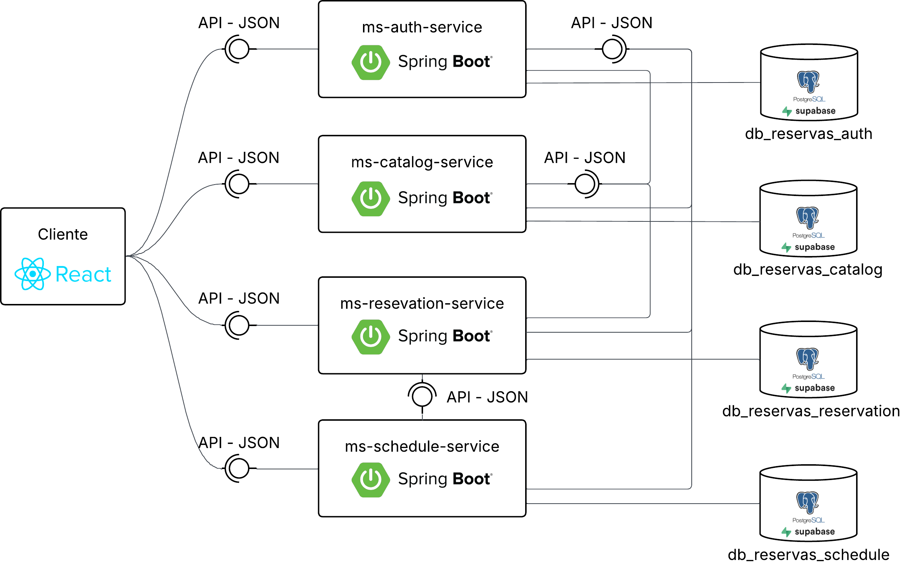
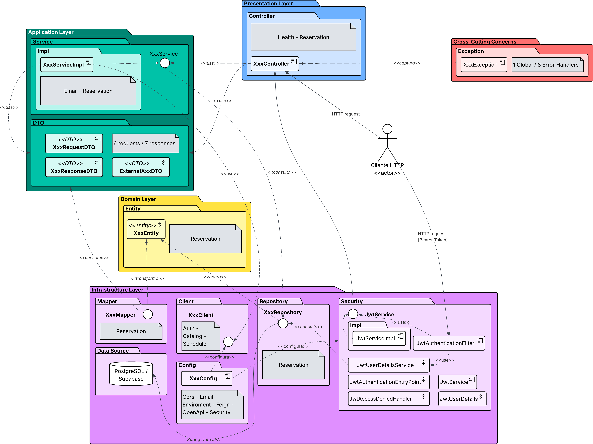
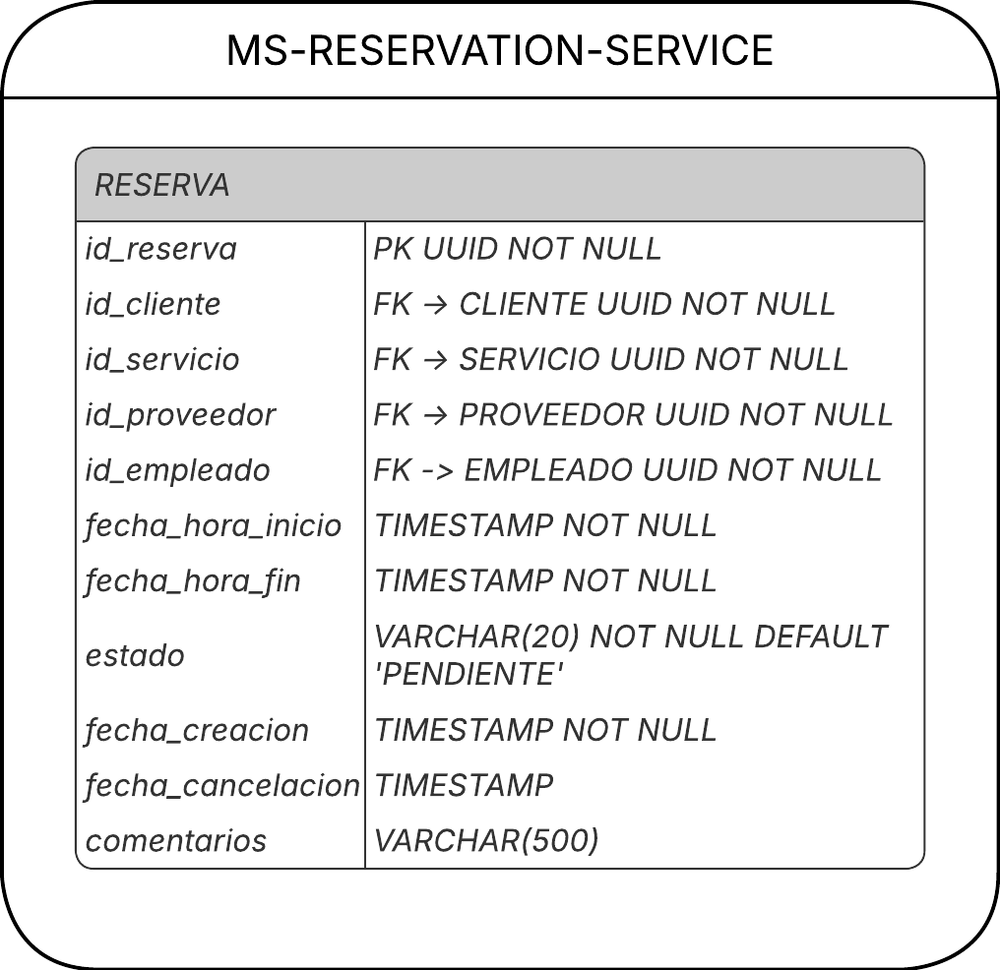
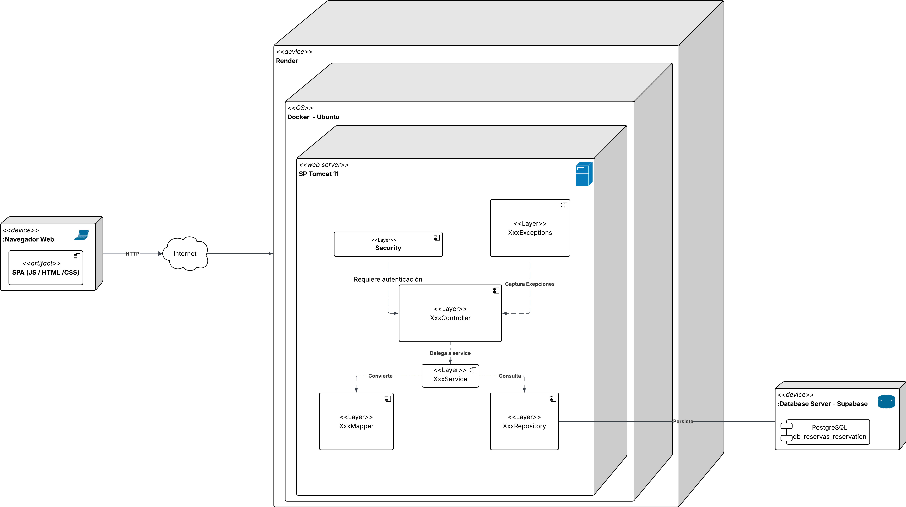
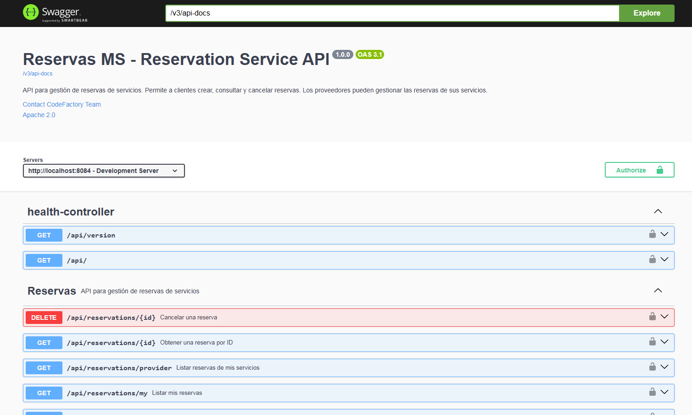

# Plataforma de Reservas de Servicios - MS-Reservation-Service

[](https://github.com/Isa-Bedoya-UdeA/Reservas-MS-Reservation-Service/actions/workflows/build.yml)
[](https://sonarcloud.io/summary/new_code?id=Isa-Bedoya-UdeA_Reservas-MS-Reservation-Service)
[](https://sonarcloud.io/summary/new_code?id=Isa-Bedoya-UdeA_Reservas-MS-Reservation-Service)
[](https://sonarcloud.io/summary/new_code?id=Isa-Bedoya-UdeA_Reservas-MS-Reservation-Service)
[](https://sonarcloud.io/summary/new_code?id=Isa-Bedoya-UdeA_Reservas-MS-Reservation-Service)
[](https://sonarcloud.io/summary/new_code?id=Isa-Bedoya-UdeA_Reservas-MS-Reservation-Service)
[](https://sonarcloud.io/summary/new_code?id=Isa-Bedoya-UdeA_Reservas-MS-Reservation-Service)

## Descripción

CodeF@ctory - Caso 15 - Plataforma de Reservas de Servicios - Microservicio de Gestión de Reservas.

## Responsabilidad

* Gestión de citas/reservas entre clientes y proveedores
* Estados de reserva: PENDIENTE, CONFIRMADA, EN_PROGRESO, COMPLETADA, CANCELADA, NO_SHOW
* Notificaciones por email (confirmación, cancelación, recordatorios)

## Tecnologías

### Backend

* **Java 17**
* **Spring Boot 3.5.14**
* **Spring Security** (Autenticación y autorización basada en JWT)
* **Spring Data JPA** (Persistencia)
* **JWT** (JSON Web Tokens para autenticación)
* **MapStruct** (Mapeo entre entidades y DTOs)
* **Lombok** (Reducción de código boilerplate)
* **Maven** (Gestión de dependencias)
* **Spring Mail** (Envío de emails)
* **Thymeleaf** (Plantillas de email HTML)

### Herramientas de Desarrollo

* **Git** (Control de versiones)
* **GitHub** (Repositorio remoto)
* **Postman** (Pruebas de APIs)
* **SonarCloud** (Análisis de calidad de código)

## Requisitos Previos

Antes de ejecutar el proyecto, asegúrate de tener instalado:

* **JDK 17** o superior
* **Maven 3.8+**
* **PostgreSQL** (Supabase)
* **Git**

## Instalación

### 1. Clonar el Repositorio

```bash
git clone https://github.com/Isa-Bedoya-UdeA/Reservas-MS-Reservation-Service
cd Reservas-MS-Reservation-Service
```

### 2. Configurar la Base de Datos y Propiedades

Copia el archivo `.env.example` a `.env`:

```bash
cp .env.example .env
```

Edita el archivo `.env` con tus credenciales de Supabase:

```bash
# SPRING PROFILE
SPRING_PROFILE=dev

# DATABASE CONFIG - SUPABASE (Transaction Pooler - IPv4 compatible)
DB_URL=jdbc:postgresql://aws-1-us-west-2.pooler.supabase.com:6543/postgres?sslmode=require&prepareThreshold=0
DB_USER=postgres.[TU-PROJECT-REF]
DB_PASSWORD=[TU-CONTRASEÑA-DE-SUPABASE]

# EXTERNAL SERVICES URLs
SERVICES_AUTH_URL=http://localhost:8081
SERVICES_CATALOG_URL=http://localhost:8082
SERVICES_SCHEDULE_URL=http://localhost:8083
```

### 3. Configurar JWT

Genera un JWT_SECRET seguro:

```bash
openssl rand -base64 64
```

Agrega el JWT_SECRET generado a tu archivo `.env`:

```bash
JWT_SECRET=[TU-JWT-SECRET-SEGURA]
JWT_ACCESS_EXPIRATION=900000
JWT_REFRESH_EXPIRATION=604800000
```

> **IMPORTANTE:** El JWT_SECRET debe ser el mismo en todos los microservicios.

### 4. Compilar el Proyecto

```bash
# Limpia el target y compila
Remove-Item -Recurse -Force target -ErrorAction SilentlyContinue
mvn clean compile
```

### 5. Ejecutar la Aplicación

```bash
mvn spring-boot:run
```

> **IMPORTANTE:** Para el correcto funcionamiento, debes tener corriendo los microservicios:
> * Auth Service (puerto 8081)
> * Catalog Service (puerto 8082)
> * Schedule Service (puerto 8083)

La aplicación estará disponible en: `http://localhost:8084`

## Estructura del Proyecto

```plain text
Reservas-MS-Reservation-Service/
├── src/
│   ├── main/
│   │   ├── java/com/codefactory/reservasmsreservationservice/
│   │   │   ├── client/              # Feign Clients para comunicación entre microservicios
│   │   │   ├── config/              # Configuración de Spring (Security, CORS, Email, etc.)
│   │   │   ├── controller/          # Controladores REST (Reservation, Health)
│   │   │   ├── dto/                 # Data Transfer Objects (Request y Response)
│   │   │   │   ├── external/       # DTOs de servicios externos
│   │   │   │   ├── request/        # DTOs de solicitud
│   │   │   │   └── response/        # DTOs de respuesta
│   │   │   ├── entity/              # Entidades JPA (Reservation)
│   │   │   ├── exception/           # Excepciones personalizadas y manejo global
│   │   │   ├── mapper/              # Mapeadores (MapStruct) entre entidades y DTOs
│   │   │   ├── repository/          # Repositorios Spring Data JPA
│   │   │   ├── security/            # Seguridad (JWT filter, handlers)
│   │   │   │   └── impl/            # Implementaciones de seguridad
│   │   │   ├── service/             # Interfaces de servicios
│   │   │   └── service/impl/        # Implementaciones de servicios
│   │   └── resources/
│   │       ├── application.properties
│   │       ├── application-dev.properties
│   │       ├── application-prod.properties
│   │       ├── application-test.properties
│   │       └── templates/           # Plantillas Thymeleaf para emails
│   │           ├── reservation-confirmation.html
│   │           ├── reservation-cancellation.html
│   │           └── reservation-reminder.html
│   └── test/
│       ├── java/                    # Tests unitarios y de integración
│       └── resources/
│           └── application-test.properties
├── docs/                            # Documentación y pruebas de API
├── .env.example                     # Plantilla de variables de entorno
├── .env                             # Variables de entorno (no versionado)
├── pom.xml                          # Configuración de Maven
└── README.md
```

## Estados de Reserva

```plain text
PENDIENTE → CONFIRMADA → EN_PROGRESO → COMPLETADA
    ↓           ↓            ↓
  CANCELADA   CANCELADA     NO_SHOW
```

## Endpoints Principales

### Health Check

* `GET /api/`: Health Check - Retorna estado del servicio
* `GET /api/version`: Version Check - Retorna versión del servicio

### Reservas (Clientes)

* `POST /api/reservations`: Crear una nueva reserva (requiere ROLE_CLIENTE o ADMIN)
* `GET /api/reservations/{id}`: Obtener reserva por ID
* `GET /api/reservations/my`: Listar mis reservas (cliente autenticado)
* `PUT /api/reservations/{id}`: Reprogramar/actualizar reserva
* `DELETE /api/reservations/{id}`: Cancelar reserva

### Reservas (Proveedores/Admins)

* `GET /api/reservations/provider`: Listar reservas de mis servicios (ROLE_PROVEEDOR)
* `GET /api/reservations/employee/{id}`: Listar reservas de un empleado
* `PATCH /api/reservations/{id}/status`: Cambiar estado de reserva (confirmar, completar, no-show)

## Notificaciones por Email

El microservicio envía automáticamente correos electrónicos en los siguientes casos:

1. **Confirmación de reserva:** Cuando un cliente crea una nueva reserva exitosamente
2. **Cancelación de reserva:** Cuando un cliente cancela su reserva
3. **Recordatorio de reserva:** (Pendiente implementación) Recordatorio antes de la cita

## Códigos de Error

| Código | Error | Descripción |
| ------ | ----- | ----------- |
| RESERVATION_NOT_FOUND | 404 | Reserva no encontrada |
| RESERVATION_CONFLICT | 409 | Horario no disponible |
| INVALID_RESERVATION_STATE | 400 | Estado de reserva inválido para la operación |
| RESERVATION_ACCESS_DENIED | 403 | No tienes permisos sobre esta reserva |
| VALIDATION_ERROR | 400 | Error de validación en datos de entrada |
| RESOURCE_NOT_FOUND | 404 | Recurso externo no encontrado |
| EXTERNAL_SERVICE_ERROR | 503 | Servicio externo no disponible |
| AUTHENTICATION_REQUIRED | 401 | No estás autenticado |
| ACCESS_DENIED | 403 | No tienes permisos para esta acción |

## Diagramas

### Diseño Arquitectónico



### Diagrama de Paquetes y Componentes



### Diagrama MER Lógico



### Diagrama de Despliegue



## Documentación de API (Swagger/OpenAPI)



**Ruta de acceso:** http://localhost:8084/swagger-ui/index.html#/

## Variables de Entorno para Despliegue

Para configurar el despliegue del microservicio, consulta la documentación detallada de variables de entorno:

**[docs/environment-variables.md](docs/environment-variables.md)**

También puedes usar el archivo de ejemplo como plantilla:
**[.env.example](.env.example)** - Copia este archivo a `.env` y configura tus valores.

## Secrets para Kubernetes

Para el despliegue en Kubernetes, consulta la documentación de secrets:

**[docs/kubernetes-secrets.md](docs/kubernetes-secrets.md)**

## Observabilidad: Kubernetes, ArgoCD, Prometheus y Grafana

**[docs/observability.md](docs/observability.md)** — Guía paso a paso para desplegar y monitorear el microservicio.

## Pruebas en Postman

Para ver las pruebas detalladas de la API, consulta el archivo [docs/PruebasPostman.md](docs/PruebasPostman.md)